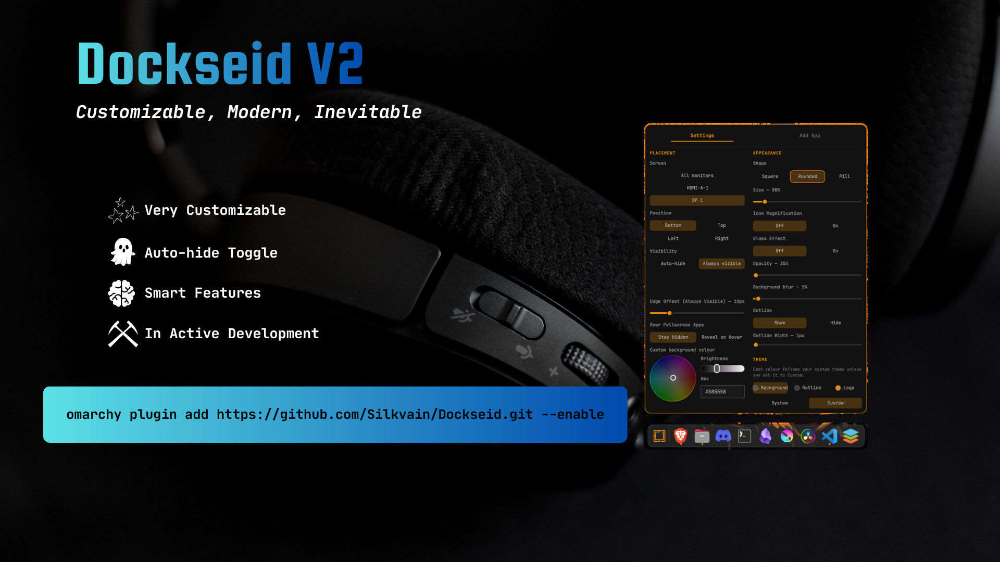

# Dockseid



A macOS-style pill dock for [Omarchy](https://omarchy.org). It shows your running
and pinned apps, groups every window of an app under one icon, and follows your
Omarchy theme, with glass and blur effects, icon magnification and per-colour
overrides if you want the dock to look different from the rest of the desktop.

## Install

```sh
omarchy plugin add https://github.com/Silkvain/Dockseid.git --enable
```

For local development, link this folder to
`~/.config/omarchy/plugins/io.github.silkvain.dockseid` and run:

```sh
omarchy plugin enable io.github.silkvain.dockseid
```

## Features

**Apps**
- Every running application gets an icon, with a small dot while it's open.
- Pin apps to keep them in the dock: right-click an icon, or use the **Add App**
  tab in the settings to search for one you haven't opened yet.
- All windows of an app stack on a single icon. Click to cycle through them, or
  hover to see the list and jump straight to one.
- Drag icons to reorder them. The order is remembered.
- Web apps (Discord, YouTube, WhatsApp and other browser app windows) group under
  their own app icon instead of showing up as a separate one.
- Omarchy's agent windows show the mark of the agent you picked in Omarchy
  (Claude Code or Codex), and follow it if you change it. Other agents get a
  terminal icon.
- Hover labels are small speech bubbles. Browser windows show the site name, or
  "New Window" when nothing is loaded.

**Look**
- Follows your active Omarchy theme, including the icon theme colour when you
  switch themes.
- **Glass** effect: a frosted, translucent dock over a blurred copy of your wallpaper.
- Adjustable **opacity** and **background blur**. Blur shows through when opacity
  is below 100%.
- **Icon magnification**: icons grow under the cursor, macOS-style (optional).
- Shape: Square, Rounded or Pill. Adjustable size and outline width.
- **Background, outline and the Omarchy logo** can each be set to your own colour
  with a colour wheel, independently. Anything you don't set follows the theme.
- Sharp vector icons for many popular apps ship with the plugin. Other apps use
  your system icon theme.

**Behaviour**
- **Auto-hide**: the dock slides in when you move the pointer to its screen edge.
  Or **Always visible**, which reserves its own strip of the screen so windows
  tile around it.
- Put it on any edge (bottom, top, left, right) of one monitor or all of them.
- **Over fullscreen apps**: keep the dock hidden, or reveal it on hover over a
  fullscreen window.
- **When workspace is empty**: with auto-hide, the dock can stay visible while
  the workspace you're on has no windows.

## Usage

- **Left click**: launch a pinned app that isn't running, minimise or restore a
  single window, or cycle to the next window of a group.
- **Middle click**: close all of an app's windows.
- **Right click**: keep in or remove from the dock, open, new window (for apps that
  offer it), or quit.
- **Hover**: the app name, or the list of windows for a group.
- **Drag**: reorder icons.
- **Omarchy logo button** (leftmost): opens the settings.

## Settings

Click the Omarchy logo on the dock. Everything is set there, so there are no files
to edit. The **Settings** tab has three groups:

- **Placement**: screen, position, visibility, when the workspace is empty,
  edge offset, and behaviour over fullscreen apps.
- **Appearance**: shape, size, icon magnification, glass, opacity, background
  blur and the outline.
- **Theme**: pick Background, Outline or Logo, then choose **System** or **Custom**
  for it. A colour you picked is remembered if you switch back to System.

Choosing **Glass** sets its own opacity, blur and outline, so those controls are
greyed out while it's on.

Your settings and pinned apps are stored in
`~/.local/state/dockseid/state.json`.

## Notes

- Built for Omarchy on Hyprland. Workspace-based behaviour uses Hyprland's
  workspace information.
- The blur effect blurs your wallpaper, not the windows behind the dock.
- Bundled icons: see [icons/README.md](icons/README.md) for the sources and
  licences. App logos remain the property of their owners.

## License

MIT. See [LICENSE](LICENSE).
